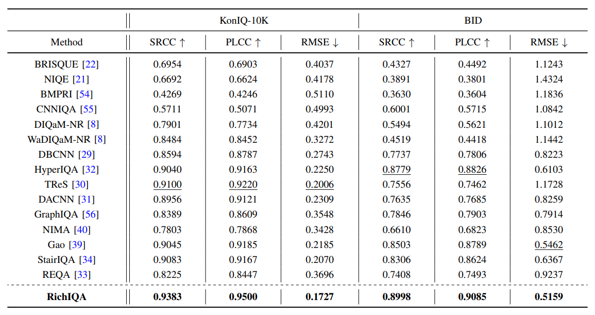

# RichIQA: Exploring Rich Subjective Quality Information for Image Quality Assessment in the Wild

[Xiongkuo Min](https://minxiongkuo.github.io/), [Yixuan Gao](https://scholar.google.com/citations?user=b1iuPdAAAAAJ&hl=zh-CN&oi=sra), [Yuqin Cao](https://scholar.google.com/citations?user=R2VyxsgAAAAJ&hl=zh-CN&oi=sra), [Guangtao Zhai](https://scholar.google.com/citations?user=E6zbSYgAAAAJ&hl=zh-CN&oi=sra), Wenjun Zhang, Huifang Sun, and Chang Wen Chen.

Official implementation of “[Exploring Rich Subjective Quality Information for Image Quality Assessment in the Wild](https://arxiv.org/pdf/2409.05540)”


#### 🔥 Abstract of RichIQA
---

> **Abstract:** Traditional in the wild image quality assessment
(IQA) models are generally trained with the quality labels of
mean opinion score (MOS), while missing the rich subjective
quality information contained in the quality ratings, for example,
the standard deviation of opinion scores (SOS) or even distribution
of opinion scores (DOS). In this paper, we propose a novel
IQA method named RichIQA to explore the rich subjective
rating information beyond MOS to predict image quality in the
wild. RichIQA is characterized by two key novel designs: (1) a
three-stage image quality prediction network which exploits the
powerful feature representation capability of the Convolutional
vision Transformer (CvT) and mimics the short-term and longterm memory mechanisms of human brain; (2) a multi-label
training strategy in which rich subjective quality information like
MOS, SOS and DOS are concurrently used to train the quality
prediction network. Powered by these two novel designs, RichIQA
is able to predict the image quality in terms of a distribution,
from which the mean image quality can be subsequently obtained.
Extensive experimental results verify that the three-stage network
is tailored to predict rich quality information, while the multilabel training strategy can fully exploit the potentials within
subjective quality rating and enhance the prediction performance
and generalizability of the network. RichIQA outperforms stateof-the-art competitors on multiple large-scale in the wild IQA
databases with rich subjective rating labels. 

#### 🔥🔥 Framework of RichIQA


#### 🔥🔥🔥  Results of RichIQA


## Preparation

Before running the program, you need to download pretrained
[CvT](https://onedrive.live.com/?authkey=%21AMXesxbtKwsdryE&id=56B9F9C97F261712%2115004&cid=56B9F9C97F261712)
 models (CvT-21-384x384-IN-22k.pth). And put the downloaded weight in the checkpoint folder.

## Train
python main.py


## Inference
python inference.py

Note: Change "MODEL_PATH" to the trained model path. "image_path" is changed to the test image path.
# Citation
If you have any questions, please let me know. If you find the code helpful in your research or work, please cite the following paper(s).

```
@article{min2025exploring,
  title={Exploring rich subjective quality information for image quality assessment in the wild},
  author={Min, Xiongkuo and Gao, Yixuan and Cao, Yuqin and Zhai, Guangtao and Zhang, Wenjun and Sun, Huifang and Chen, Chang Wen},
  journal={IEEE Transactions on Circuits and Systems for Video Technology},
  year={2025},
  publisher={IEEE}
}
```
